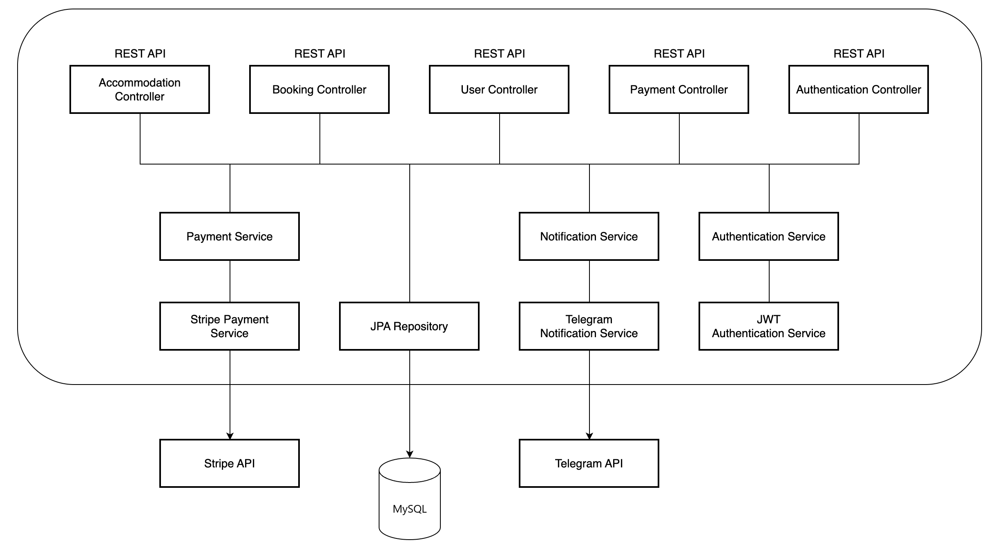
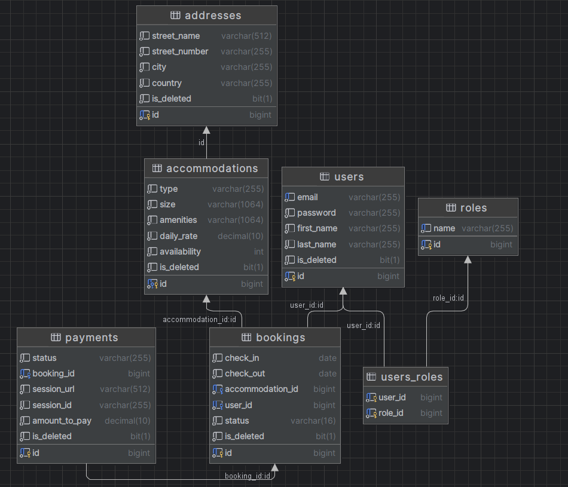

# Welcome to Accommodation Booking Service project!

* ### Do you have an **accommodation** booking business? 

* #### But are all processes carried out in a __bullet-proof way of manual recording and administration__?

* #### Is all data stored in dusty shelves with paper folders?

* #### Do you want to expand to the modern majority?

## If at least one option affected your problem, then **come to us**!

---

Our team, QuackCraft, offers you a solution to all your problems. \
We designed and implemented all the **necessary business processes** that will certainly help you in your development!

---

# Description of the project

## in this project we used the following technologies:

  
 Java

  
`In this project, we used Java as the main programming language.`

  
 Spring Boot

 
`A powerful framework for building Java-based applications.`

  
 Spring Data JPA

  
`Simplifies data access and persistence with JPA (Java Persistence API).`

  
 Spring Security

  
`Enables robust and secure authentication and authorization mechanisms.`

  
 Swager

  
 `Provides API documentation.`

  
 MySQL 

  
` Utilization of a relational database to store information about: `

` * 🏨 accommodations;  ` \
` * 🦲 users; ` \
` * addresses; ` \
` * bookings; ` \
` * payments. `

  
 Telegram API

  
` Used to send notifications to administrators via Telegram. `

  
 Stripe API

  
`Integrated with Stripe for secure payment processing.`

  
 Google Maps API

`Used to display the location of accommodation.`

  
 Docker

  
`Used for containerization of the application and database.`

  
 Lombok

`Reduces boilerplate code with annotations.`

  
 Mapstruct

`Simplifies object mapping between DTOs and entities.`

  
 Liquibase 

`Ensures the application database is updated along with the application code.`

 

---

# Project architecture: 
\
 

---

# Database structure:
\

---

# Project controllers with the following endpoints:

---

## **Authentication Controller:**

| **HTTP method** | **Endpoint**  | **Role** | **Function** |
|:----------------:|:--------------:|:--------:|:-------------|
| POST | /register | ALL | Allows users to register a new account. |
| POST | /login | ALL | Get JWT tokens for authentication. |

---

## **User Controller:** _Managing authentication and user registration_

| **HTTP method** | **Endpoint**          | **Role** | **Function**                                                        |
|:----------------:|:----------------------:|:--------:|:--------------------------------------------------------------------|
| PUT              | /users/{id}/role      |  ADMIN   | Enables admins to update their roles, providing role-based access.  |
| GET              | /users/me             |   ALL    | Retrieves the profile information for the currently logged-in user. |
| PUT/PATCH        | /users/me             |   ALL    | Allows users to update their profile information.                   |

---

## **Accommodation Controller:** _Managing accommodation inventory (CRUD for Accommodations)_

| **HTTP method** | **Endpoint**         | **Role** | **Function**                                         |
|:----------------:|:---------------------:|:--------:|:-----------------------------------------------------|
| POST             | /accommodations      |  ADMIN   | Permits the addition of new accommodations.          |
| GET              | /accommodations      |   ALL    | Provides a list of available accommodations.        |
| GET              | /accommodations/{id} |   ALL    | Retrieves detailed information about a specific accommodation. |
| PUT/PATCH        | /accommodations/{id} |  ADMIN   | Allows updates to accommodation details, including inventory management. |
| DELETE           | /accommodations/{id} |   ADMIN    | Enables the removal of accommodations.                |

---

## **Booking Controller**: _Managing users' bookings_.

| **HTTP method** | **Endpoint**         | **Role**   | **Function**                                          |
|:----------------:|:---------------------:|:----------:|:------------------------------------------------------|
| POST             | /bookings            | ALL        | Permits the creation of new accommodation bookings.   |
| GET              | /bookings/?user_id=...&status=... | ADMIN | Retrieves bookings based on user ID and their status. |
| GET              | /bookings/my         | ALL        | Retrieves user bookings.                              |
| GET              | /bookings/{id}       | ALL        | Provides information about a specific booking.        |
| PUT/PATCH        | /bookings/{id}       | ADMIN        | Allows admins to update  booking details.        |
| DELETE           | /bookings/{id}       | ADMIN        | Enables the cancellation of bookings.                 |

---

## **Payment Controller (Stripe)**: _Facilitates payments for bookings through the platform. Interacts with Stripe API. Use stripe-java library._

| **HTTP method** | **Endpoint**         | **Role**   | **Function**                                         |
|:----------------:|:---------------------:|:----------:|:-----------------------------------------------------|
| GET              | /payments/?user_id=...| ALL        | Retrieves payment information for users.             |
| POST             | /payments/            | ALL        | Initiates payment sessions for booking transactions. |
| GET              | /payments/success/    | ALL        | Handles successful payment processing through Stripe redirection. |
| GET              | /payments/cancel/     | ALL        | Manages payment cancellation and returns payment paused messages during Stripe redirection. |
 

---

# About notification:

\
`Notifications about:` \
`- new bookings created/canceled,` \
`- new created/released accommodations,` \
`- and successful payments` \
`Other services interact with it to send notifications to booking service administrators.` 

###### Used Telegram API, Telegram Chats, and Bots.

---

